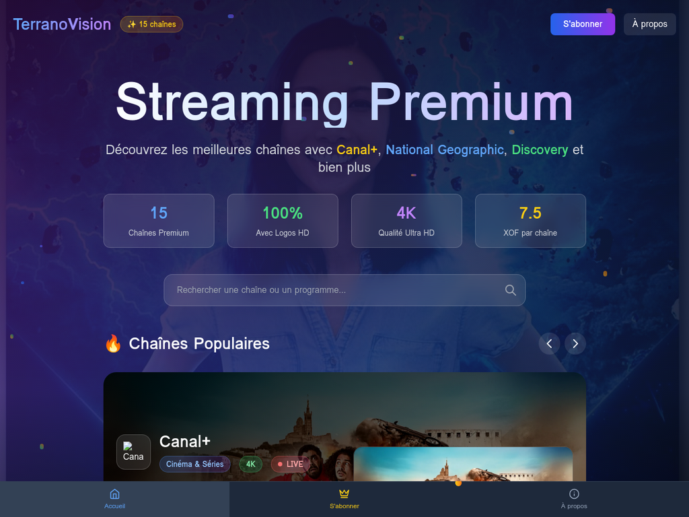

# 🎬 TerranoVision 2.0 - Plateforme de Streaming Premium



**TerranoVision 2.0** est une plateforme de streaming premium ultra-moderne offrant l'accès à plus de **2,674 chaînes** de télévision avec un design révolutionnaire et une expérience utilisateur exceptionnelle.

## ✨ Fonctionnalités Principales

### 🎯 Catalogue Premium
- **2,674+ chaînes premium** avec logos HD
- **Accès à tous les films** inclus dans tous les plans
- **Qualité streaming** jusqu'à 8K HDR
- **Chaînes populaires** : Canal+, National Geographic, Discovery, MTV, Eurosport
- **Catégories diversifiées** : Cinéma, Sport, Documentaires, Actualités, Musique

### 🎨 Design Ultra-Moderne
- **Interface glassmorphism** avec effets de transparence
- **Particules animées** flottantes pour une ambiance immersive
- **Images premium Canal+** en arrière-plan rotatif
- **Gradients dynamiques** et animations fluides
- **Navigation intuitive** avec carousel des chaînes populaires

### 💳 Paiement Wave Intégré
- **Wave comme unique moyen de paiement** pour le marché africain
- **QR Code Wave** pour paiements instantanés
- **Logo Wave officiel** intégré dans l'interface
- **Processus de paiement sécurisé** et simplifié
- **Activation immédiate** après paiement

### 📱 Expérience Multi-Plateforme
- **Interface responsive** optimisée pour tous les appareils
- **PWA (Progressive Web App)** installable
- **Support mobile** avec navigation tactile
- **Compatibilité desktop** avec raccourcis clavier

## 💰 Plans Tarifaires

| Plan | Prix | Durée | Prix/mois | Économie | Avantages |
|------|------|-------|-----------|----------|-----------|
| **Mensuel** | 5,000 XOF | 1 mois | 5,000 XOF | - | Accès complet, sans engagement |
| **Trimestriel** ⭐ | 12,000 XOF | 3 mois | 4,000 XOF | 3,000 XOF | Plus populaire, support prioritaire |
| **Semestriel** 👑 | 20,000 XOF | 6 mois | 3,333 XOF | 10,000 XOF | Meilleure valeur, qualité 8K |

### 🎁 Inclus dans tous les plans
- ✅ Accès à tous les films
- ✅ Plus de 2,674 chaînes premium
- ✅ Streaming illimité 24h/24
- ✅ Support client 24/7
- ✅ Compatible tous appareils
- ✅ Garantie satisfait ou remboursé 7 jours

## 🚀 Installation et Démarrage

### Prérequis
- Node.js 18+ 
- pnpm (gestionnaire de paquets)
- Git

### Installation
```bash
# Cloner le repository
git clone https://github.com/Terranoweb2/Terranovision-2.0.git
cd Terranovision-2.0

# Installer les dépendances
pnpm install

# Démarrer l'application
pnpm dev
```

### Accès
- **Frontend** : http://localhost:3002
- **Backend** : http://localhost:3001

## 🏗️ Architecture Technique

### Stack Frontend
- **React 18** avec TypeScript
- **Vite** pour le build ultra-rapide
- **Tailwind CSS** pour le design system
- **Zustand** pour la gestion d'état
- **Shaka Player** pour le lecteur vidéo professionnel

### Stack Backend
- **Node.js** avec Express
- **WebSocket** pour la communication temps réel
- **SQLite** pour la base de données locale
- **API REST** optimisée

### Fonctionnalités Avancées
- **Lazy Loading** des images pour les performances
- **Service Worker** pour le mode hors-ligne
- **Monitoring des performances** intégré
- **Système de cache** intelligent

## 📁 Structure du Projet

```
Terranovision-2.0/
├── apps/
│   ├── web/                    # Application frontend React
│   │   ├── src/
│   │   │   ├── components/     # Composants React
│   │   │   ├── pages/          # Pages de l'application
│   │   │   ├── hooks/          # Hooks personnalisés
│   │   │   ├── services/       # Services et API
│   │   │   ├── stores/         # Gestion d'état Zustand
│   │   │   └── styles/         # Styles CSS et animations
│   │   └── public/
│   │       └── images/         # Assets et images
│   └── server/                 # Backend Node.js
├── playlists/                  # Playlists M3U des chaînes
├── scripts/                    # Scripts de développement
├── data/                       # Données et catalogues
└── docs/                       # Documentation et captures
```

## 🎬 Fonctionnalités de Streaming

### Lecteur Vidéo Premium
- **Shaka Player** de Google pour la lecture professionnelle
- **Support HLS (.m3u8)** et DASH (.mpd)
- **Qualité adaptative** selon la connexion
- **Contrôles personnalisés** avec design moderne
- **Mode plein écran** optimisé

### Gestion des Chaînes
- **Recherche instantanée** par nom ou catégorie
- **Filtres avancés** par qualité et type
- **Système de favoris** avec stockage local
- **Historique de visionnage** personnalisé
- **Recommandations intelligentes**

## 🌊 Intégration Wave

### Processus de Paiement
1. **Sélection du plan** sur la page d'abonnement
2. **Affichage du QR Code Wave** personnalisé
3. **Scan avec l'app Wave** sur mobile
4. **Confirmation du montant** et validation
5. **Activation immédiate** de l'abonnement

### Sécurité
- **Transactions cryptées** via Wave
- **Authentification biométrique** disponible
- **Conformité bancaire** africaine
- **Support Wave** intégré

## 📊 Performances et Optimisations

### Optimisations Frontend
- **Code splitting** automatique avec Vite
- **Lazy loading** des composants et images
- **Compression des assets** en production
- **Cache intelligent** des données
- **Preloading** des ressources critiques

### Monitoring
- **Métriques de performance** en temps réel
- **Suivi des erreurs** automatique
- **Analytics d'usage** respectueux de la vie privée
- **Monitoring de la qualité vidéo**

## 🛡️ Sécurité et Confidentialité

### Protection des Données
- **Stockage local uniquement** pour les favoris
- **Aucune collecte de données personnelles**
- **Chiffrement des communications**
- **Respect du RGPD** et des lois locales

### Contrôle Parental
- **Filtrage par âge** disponible
- **Blocage de contenu** personnalisable
- **Historique parental** consultable
- **Restrictions horaires** configurables

## 🌍 Déploiement et Production

### Environnements
- **Développement** : http://localhost:3002
- **Staging** : À configurer selon vos besoins
- **Production** : Prêt pour déploiement CDN

### Déploiement Recommandé
- **Frontend** : Vercel, Netlify, ou CDN
- **Backend** : VPS, AWS, ou Google Cloud
- **Base de données** : PostgreSQL en production
- **CDN** : CloudFlare pour la distribution mondiale

## 📞 Support et Maintenance

### Support Client
- **Chat en direct** intégré (à configurer)
- **FAQ complète** dans l'application
- **Guides vidéo** pour les utilisateurs
- **Support Wave** pour les paiements

### Maintenance
- **Mises à jour automatiques** des chaînes
- **Monitoring 24/7** des services
- **Sauvegarde quotidienne** des données
- **Alertes proactives** en cas de problème

## 🚀 Roadmap Future

### Fonctionnalités Prévues
- **Application mobile native** (iOS/Android)
- **Mode hors-ligne** avec téléchargements
- **Chromecast et AirPlay** support
- **Profils utilisateurs multiples**
- **Recommandations IA** avancées

### Intégrations
- **Autres moyens de paiement** africains
- **API de recommandations** externes
- **Intégration réseaux sociaux**
- **Analytics avancées** pour les créateurs

## 📄 Licence et Légal

### Avertissement Important
**TerranoVision** est une plateforme de streaming. L'utilisateur est entièrement responsable du contenu qu'il choisit de visionner et doit :
- Respecter les droits d'auteur et licences
- Vérifier les autorisations géographiques
- Se conformer aux lois locales en vigueur
- Utiliser uniquement des flux légaux et autorisés

### Licence
Ce projet est sous licence MIT. Voir le fichier `LICENSE` pour plus de détails.

---

## 🎯 Contact et Contribution

**Développé avec ❤️ par l'équipe TerranoVision**

- **GitHub** : [Terranoweb2/Terranovision-2.0](https://github.com/Terranoweb2/Terranovision-2.0)
- **Version** : 2.0 Final avec Wave
- **Dernière mise à jour** : Octobre 2025

### Contribution
Les contributions sont les bienvenues ! Merci de :
1. Fork le projet
2. Créer une branche feature
3. Commit vos changements
4. Push vers la branche
5. Ouvrir une Pull Request

---

**🌟 TerranoVision 2.0 - L'avenir du streaming premium en Afrique ! 🌟**
